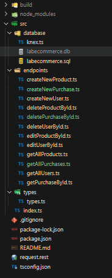

# Labecommerce-backend

A Labecommerce-backend é uma API que simula o fluxo de trabalho de um ecommerce, mas trata-se de um projeto acadêmico, que faz parte da lista de atividades do curso desenvolvedor web full stack da Labenu, onde apliquei toda a base de criação de uma API vinculada a um banco de dados real.

## Índice:
- <a href="#-layout">Layout</a>
- <a href="#-requisições"> Requisições</a>
- <a href="#-exemplo-de-requisições">Exemplo de Requisições</a>
- <a href="#-como-rodar-este-projeto">Como rodar este projeto</a>
- <a href="#-tecnologias-utilizadas">Tecnologias Utilizadas</a>
- <a href="#-documentação">Documentação</a>
- <a href="#-pessoa-autora">Pessoa autora</a>

## Layout

- Estrututa dos arquivos

## Requisições

### Requisições (paths):

#### REQUISIÇÔES DE USUARIOS:

- /users

#### REQUISIÇÔES DE PRODUTOS:

- /produtos

#### REQUISIÇÔES DE COMPRAS:

- /purchases

## Exemplo de requisições

#### GET ALL USERS :
    
    Requisição responsavel por: Buscar tudos os usuários.
    path: /users

#### CREATE USER :

    Requisição responsavel por: Criar um novo usuário.
    path: /users

#### EDIT USER BY ID :

    Requisição responsavel por: Editar usuário por ID.
    path: /users/:id

#### DELETE USER BY ID :

    Requisição responsavel por: Deletar um usuário por ID.
    path: /users/:id

#### GET ALL PRODUCTS :
    Requisição responsavel por: Buscar tudos os produtos
    path: /products

#### GET PRODUCTS BY NAME :

    Requisição responsavel por: Buscar produtos por nome
    path: /products?name=

#### CREATE PRODUCT :

    Requisição responsavel por: Criar um novo produto.
    path: /products

#### EDIT PRODUCT BY ID :

    Requisição responsavel por: Editar produto por ID.
    path: /products/:id

#### DELETE PRODUCT BY ID :

    Requisição responsavel por: Deletar um produto por ID.
    path: /products/:id

#### GET ALL PURCHASES :
    
    Requisição responsavel por: Buscar tudas as compras.
    path: /purchases

#### GET PURCHASE BY ID :
    
    Requisição responsavel por: Buscar compra por ID.
    path: /purchases/:id

#### CREATE PURCHASE :

    Requisição responsavel por: Criar uma nova compra.
    path: /purchases

#### DELETE PURCHASE BY ID :

    Requisição responsavel por: Deletar uma compra por ID.
    path: /purchases/:id

## Como rodar este projeto

``# Copie o link a baixo``

https://github.com/Rlopesn/Labecommerce-backend.git
***

``# Abra seu terminal e digite o seguinte comando``

**git clone (cole a url aqui)**
***

``# verifique se esto diretorio correto ou acesse ou acesse o diretorio``

**cd labecommerce-backend**
***

``# Instale as dependências``

**npm install**
***

``# Executando o Projeto``

**npm run start**

deverá aparecer a confirmação: **Servidor rodando na porta 3003**

***

## Tecnologias utilizadas

- <a style="font-size: 20px" href="https://nodejs.org/en">Node.js</a>
- <a style="font-size: 20px" href="https://www.typescriptlang.org/">TypeScript</a>
- <a style="font-size: 20px" href="https://expressjs.com/pt-br/">Express</a>
- <a style="font-size: 20px" href="https://learn.microsoft.com/pt-br/sql/?view=sql-server-ver16">SQL</a>
- <a style="font-size: 20px" href="https://www.sqlite.org/docs.html">SQLITE</a>
- <a style="font-size: 20px" href="https://knexjs.org/guide/">Knex.js</a>

## Documentação postman

<a style="font-size: 20px" href="https://documenter.getpostman.com/view/26592621/2s93z3ekEo">Documentação API postman</a>

## Pessoa autora

### Rafael Lopes Nogueira

<a style="font-size: 21px" href="https://www.linkedin.com/in/rafaellopesn/"> Meu linkedin</a>

<a style="font-size: 20px" href="https://www.instagram.com/rlopesn_/"> Meu Instagram</a>